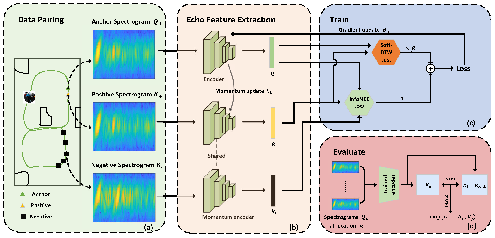

# ALCDNet: Loop Closure Detection based on Acoustic Echoes
A PyTorch implementation of ALCDNet based on RAL 2024 paper .



## Preprocessing
Download the dataset(https://github.com/zjuersdsd/ALCDNet/blob/master/data.7z) (To download the dataset, please click "Download raw file") and convert it into a spectrum:

```python -m data_process.wav2tensor --wav_folder WAV_ROOT --tensor_folder TENSOR_ROOT```

where WAV_ROOT is the path where you store audio files, and TENSOR_ROOT is the path where you store spectrums.

## Usage

### Train ALCDNet
```
 python -m train.train_moco_SD --sound_dir TENSOR_ROOT --checkpoints_dest CHECKPOINTS_ROOT --with_dtw --with_MoCo
```
where TENSOR_ROOT is the path where the data is stored, and CHECKPOINTS_ROOT is the path where you store the model. 

If you don't want to use MoCo, simply remove --with_MoCo. Similarly, if you don't want to use Soft-DTW loss, just remove --with_dtw.

### Evaluation ALCDNet

```
 python -m evaluation.test_moco_SD ---sound_dir TENSOR_ROOT --checkpoints_dest CHECKPOINTS_ROOT --validation_sequence SEQUENCE --with_dtw --with_MoCo
```
TENSOR_ROOT is the path where the data is stored, CHECKPOINTS_ROOT is the path where you store the model, and SEQUENCE is the sequence to be tested. 

If you don't want to use MoCo, simply remove --with_MoCo. Similarly, if you don't want to use Soft-DTW loss, just remove --with_dtw.

## Acknowledgments

The soft-Dtw code is heavily based on [soft-dtw](https://github.com/Maghoumi/pytorch-softdtw-cuda)，and the MoCo code is heavily based on [MoCo](https://github.com/facebookresearch/moco)

## Cite


